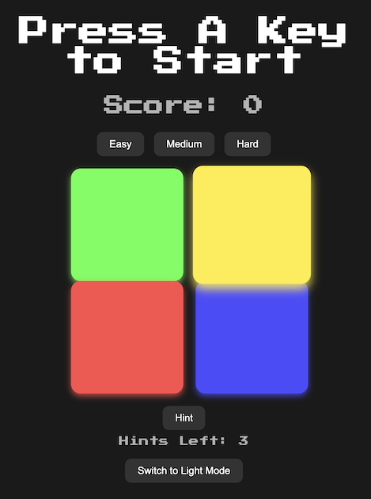

# 🟥🟪 Simon Game 🟨🟩

Welcome to the **Simon Game**, a fun and interactive memory challenge! Test your ability to remember sequences of colors and sounds while enjoying the beautiful design and engaging gameplay.

---

## 🌟 Features

- **Dynamic Difficulty**: Choose from three levels: Easy, Medium, or Hard.
- **Score Tracking**: Keep an eye on your score as you climb the levels.
- **Hints System**: Stuck? Use up to 3 hints per game to replay the current sequence.
- **Light & Dark Mode**: Toggle between light and dark themes to suit your mood.
- **Responsive Design**: Play seamlessly on desktops, tablets, and mobile devices.
- **Vivid Animations**: Enjoy colorful buttons and smooth transitions.

---

## 🎮 Demo



---

## 🕹️ How to Play

1. **Start the Game**:
   - Press any key to begin.
   - Alternatively, click the "Start Game" button if available.

2. **Follow the Pattern**:
   - Watch as the game highlights a sequence of colors.
   - Repeat the sequence by clicking the corresponding buttons.

3. **Progress Through Levels**:
   - Each level adds a new color to the sequence.
   - Repeat the entire sequence correctly to advance.

4. **Use Hints** *(Optional)*:
   - Click the **Hint** button to replay the current sequence if you're unsure.
   - You have 3 hints per game!

5. **Adjust Difficulty**:
   - Choose between **Easy**, **Medium**, or **Hard** modes before starting a game.

6. **Game Over**:
   - If you make a mistake, the game ends, and you can restart by pressing any key.

---

## 🧩 How to Run the Game

### **Option 1: Play Online**

Visit the [Simon Game](https://tia-cheng.github.io/Simon-Game/) to play directly in your browser.

### **Option 2: Play Locally**

1. Clone the repository:
   ```bash
   git clone https://github.com/tia-cheng/Simon-Game.git
2. Navigate to the project folder:
   ```bash
   cd Simon-Game
3. Open `index.html` in your browser to start playing!
---
### Enjoy the game and let the colors light up your memory! 🌈🧠✨